# Nimons360: Family location safety Android App

<p align="center">
  <a href="https://kotlinlang.org/">
    
  </a>
  <a href="https://gradle.org/">
    
  </a>

  <a href="https://developer.android.com/training/data-storage/room">
    
  </a>
  <a href="https://en.wikipedia.org/wiki/WebSocket">
    
  </a>
  <a href="https://developer.android.com/training/articles/keystore">
    
  </a>
  <a href="https://github.com/osmdroid/osmdroid">
    
  </a>
</p>

<p align="center">
    
</p>

Nimons360 is a mobile safety application designed for your family to ensure no member ever gets lost again. 
Inspired by the need for real-time connection and collective security, the app allows family members to track each other's live locations, monitor device status, and maintain close communication within private groups.

Nimons360 provides a centralized hub for safety in a fast-paced world. 
The application is built natively for Android using Kotlin and integrates RESTful APIs with WebSockets for seamless and real-time synchronization.

UI uses this main color palette

```bash
https://coolors.co/ffeaee-006d77-e29578-f4f6f8-1d3557-d62828-2a9d8f-e9c46a-457b9d
```

<p align="center">
    
</p>

## List of Content

- [Features](#features)
- [Libraries](#libraries)
- [Security Analysis](#security-analysis)
- [Screenshots and Accessibility Testing](#screenshots-and-accessibility-testing)
- [Project Structure](#project-structure)
- [Running the Program](#running-the-program)
- [Creator](#creator)
- [Team Roles](#team-roles)

## Features

1. Authentication, Profile, and Notifications
    - JWT login with encrypted token storage backed by Android Keystore.
    - Profile display-name and profile-photo updates.
    - Firebase Cloud Messaging subscription, greeting, and family notifications.
    - Internet connectivity sensing and automatic session handling.

2. Family Management and Sharing
    - Create, discover, search, join, pin, and leave families.
    - Share family invitations through links, QR codes, and Android sharing.
    - Instagram Story sharing and real-time family livestream rooms.
    - Responsive family lists and detail screens for phones, landscape, and tablets.

3. Map Extended and Background Presence
    - Interactive osmdroid map with zoom, drag, recenter, and family filters.
    - WebSocket location presence continues through a foreground service while the app is closed.
    - Member detail includes coordinates, battery and charging state, connectivity, and last update.
    - Battery state is collected through a `BroadcastReceiver`.
    - Long press or the global add menu creates marked locations using selected or current coordinates.
    - Marked locations support name, description, camera/gallery photos, Google Maps navigation, edit, and delete.
    - Location metadata is stored locally in Room/SQLite; photos are stored in the filesystem and removed with their location.

4. Custom Pins and Analytics
    - Local-only color pins and downloadable pin skins.
    - Pin downloads use a foreground service with Android notification progress.
    - Analytics dashboard includes monthly distance average, total distance, daily average, active days, daily graph, and recent location history.
    - Analytics and location history can be exported as CSV through Android's share sheet.
    - Firebase Analytics records key app events while the in-app dashboard uses local location history.

5. Quality and Platform Support
    - Responsive layouts for portrait, landscape, and tablet window sizes.
    - Accessibility labels, contrast, and touch-target improvements.
    - Security-oriented storage and networking practices following the repository's OWASP checklist.
    - REST API contract documented in [`openapi.yml`](openapi.yml).

## Libraries

- **UI**: Jetpack Compose, Android Views, Material Components, Navigation
- **Networking**: Retrofit, OkHttp, Gson
- **Database**: Room
- **Maps & Location**: osmdroid, Google Play Services
- **Media & Realtime**: Media3 (ExoPlayer), WebRTC, Agora VideoUIKit
- **Image Loading**: Coil
- **Sharing**: ZXing QR Code, Android Sharesheet, Instagram Story Intent
- **Firebase**: Analytics, Cloud Messaging, App Distribution
- **Async**: Kotlin Coroutines
- **Security**: EncryptedSharedPreferences
- **Testing**: JUnit, Espresso, Compose UI Test

## Security Analysis

The application applies client-side protections for the three OWASP Mobile Top 10
areas required by the assignment. The backend is treated as untrusted, so input and
output are still validated on the Android client.

### M4: Insufficient Input/Output Validation

- Login validates empty fields and email format before sending a request.
- Family name, six-character join code, profile name, notification message, marked-location name, description, latitude, and longitude are validated before use.
- Profile photos are decoded as images and compressed to a maximum of 500 KB before upload.
- Downloaded custom pins are checked as non-empty image files before they become selectable.
- API and location values are nullable where appropriate, with empty, loading, and error states instead of unsafe assumptions.

### M8: Security Misconfiguration

- The application uses the required `applicationId` (`com.labpro.mad`), Android 11 minimum SDK, and Android 15 target/compile SDK.
- Components that do not need external access are declared with `android:exported="false"`.
- `FileProvider` is used for camera, QR, marked-location, and CSV files instead of exposing filesystem paths.
- REST and WebSocket traffic use HTTPS/WSS; the base REST URL comes from `BuildConfig.BASE_URL`.
- HTTP body logging is enabled only in debug builds and disabled in release builds.
- Technical exceptions and HTTP codes are written to Logcat while users receive a generic, actionable error message.

### M9: Insecure Data Storage

- JWT and local privacy preferences use `EncryptedSharedPreferences` with an Android Keystore `MasterKey`.
- Authentication tokens, FCM tokens, passwords, and precise coordinates are not written to user-facing errors or analytics events.
- Android application backup is disabled so encrypted preferences and local location history are not copied through device backup.
- Marked-location photos stay in the app-private filesystem and are deleted when their location is removed.
- CSV exports are created in the cache directory and shared through temporary `FileProvider` permissions.

No additional livestream backend is used. Livestreaming uses Agora VideoUIKit directly, so there is no separate backend repository to link.

## Screenshots and Accessibility Testing

### Application Interface

| No | Page | Screenshot |
| --- | --- | --- |
| 1 | Splash Screen |  |
| 2 | Login Screen |  |
| 3 | Login Validation |  |
| 4 | Home Screen |  |
| 5 | My Families |  |
| 6 | Families Search |  |
| 7 | Create Family |  |
| 8 | Join Family |  |
| 9 | Family Detail |  |
| 10 | Leave Family |  |
| 11 | Profile |  |
| 12 | Edit Profile |  |
| 13 | Location Permission |  |
| 14 | Family Locations |  |
| 15 | Map Member Detail |  |
| 16 | Favorite Location |  |
| 17 | Connectivity Status |  |
| 18 | Offline State |  |
| 19 | Live Location |  |
| 20 | Live Room |  |
| 21 | Responsive Home | 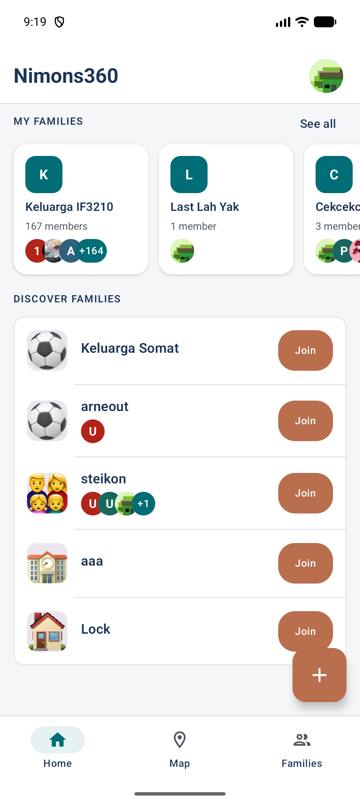 |
| 22 | Add Action Menu | 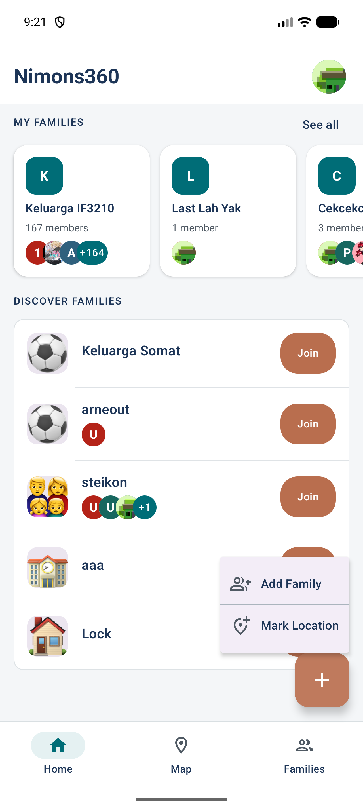 |
| 23 | Home on Tablet | 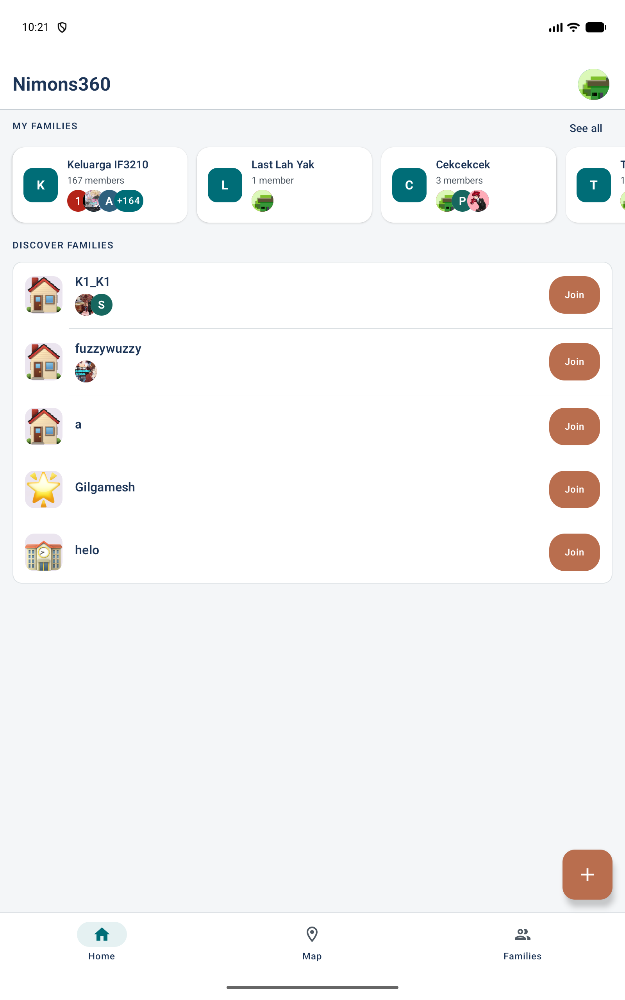 |
| 24 | Interactive Map | 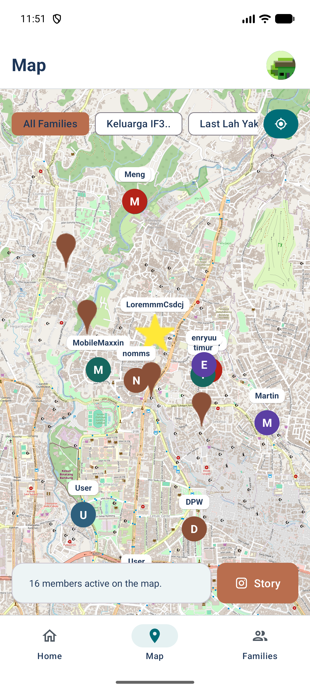 |
| 25 | Map in Landscape | 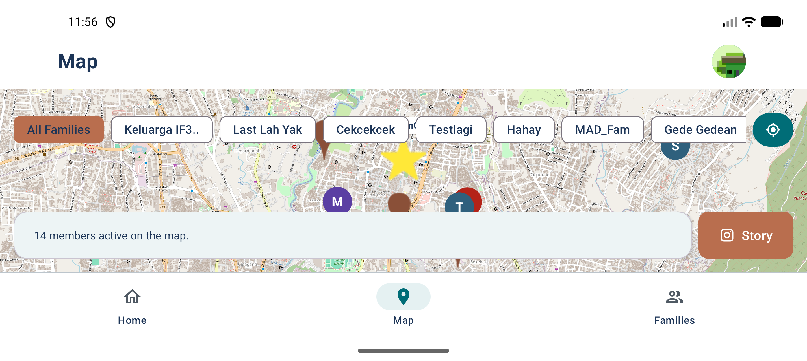 |
| 26 | Map on Tablet | 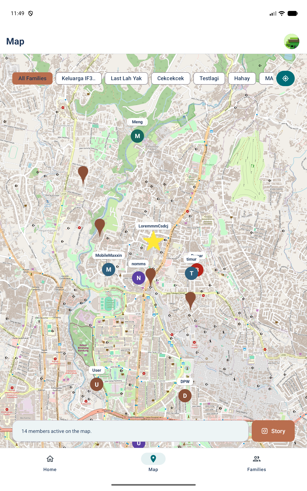 |
| 27 | Create Marked Location | 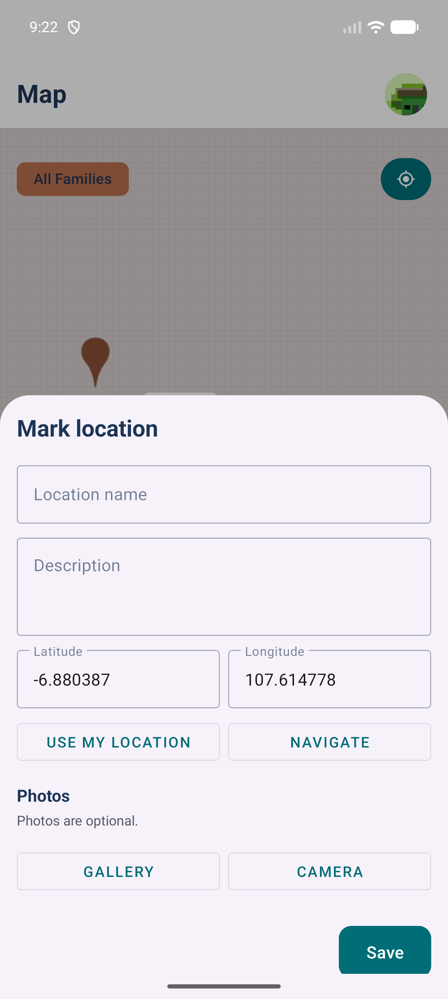 |
| 28 | Extended Member Detail | 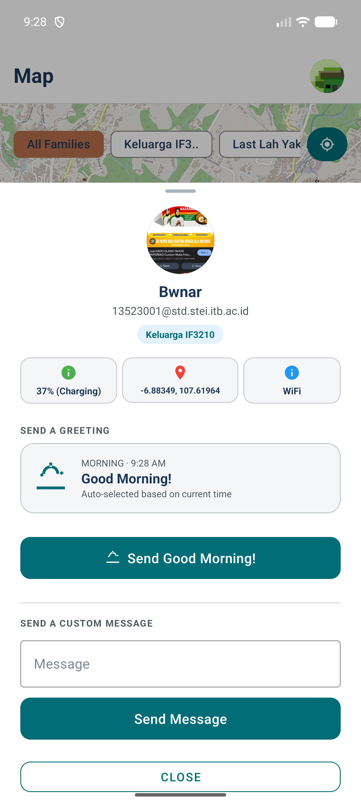 |
| 29 | Updated Profile | 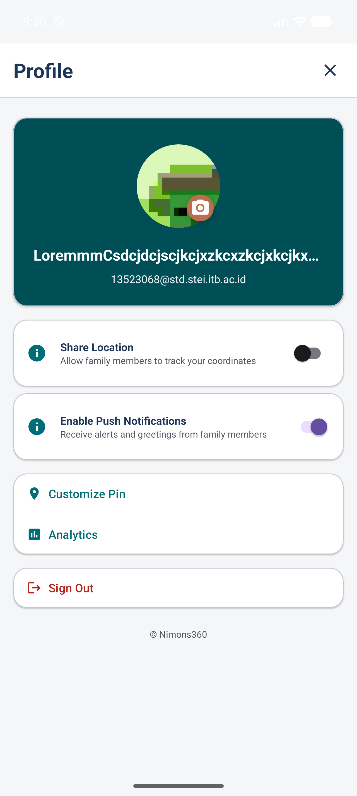 |
| 30 | Customize Pin | 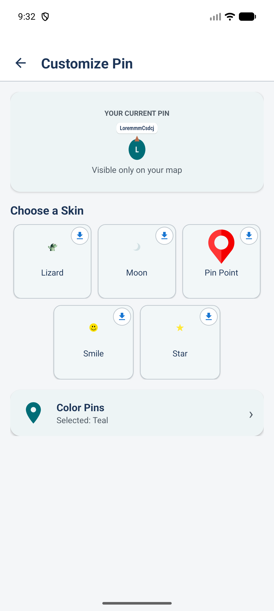 |
| 31 | Customize Pin Colors | 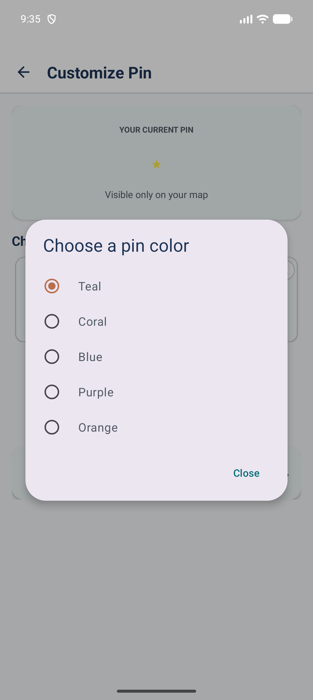 |
| 32 | Pin Download Complete | 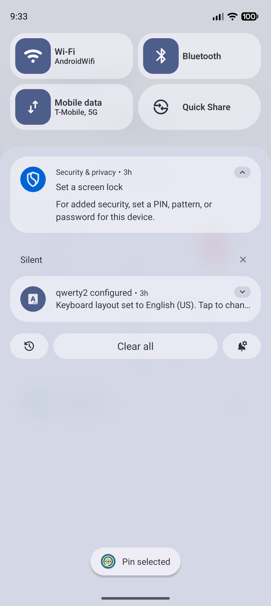 |
| 33 | Analytics Dashboard | 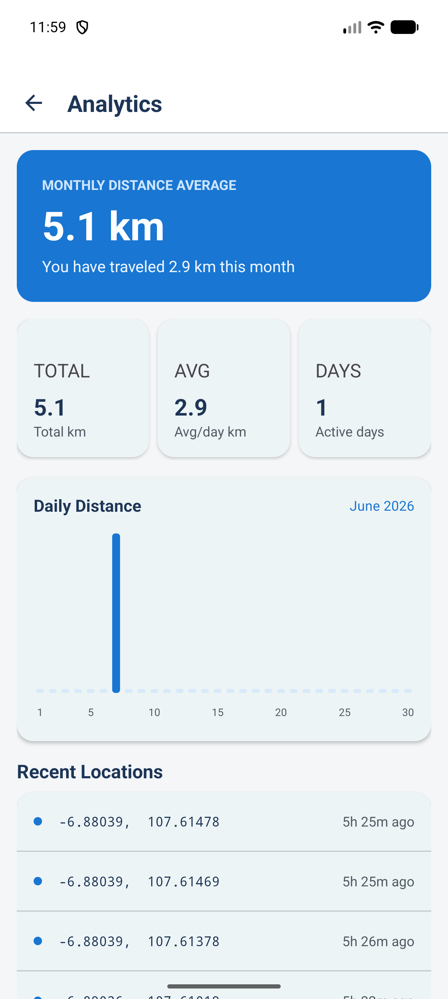 |
| 34 | Analytics History | 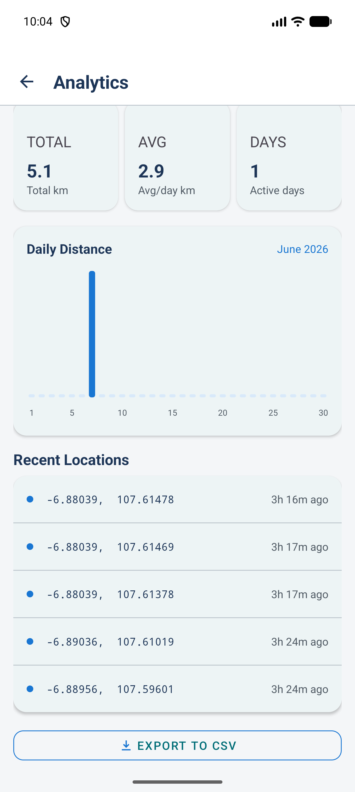 |
| 35 | Analytics on Tablet | 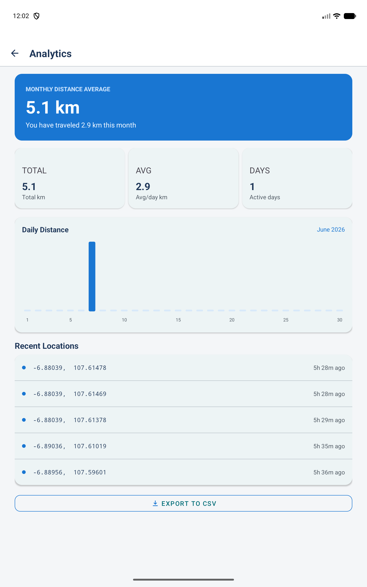 |
| 36 | Export Analytics to CSV | 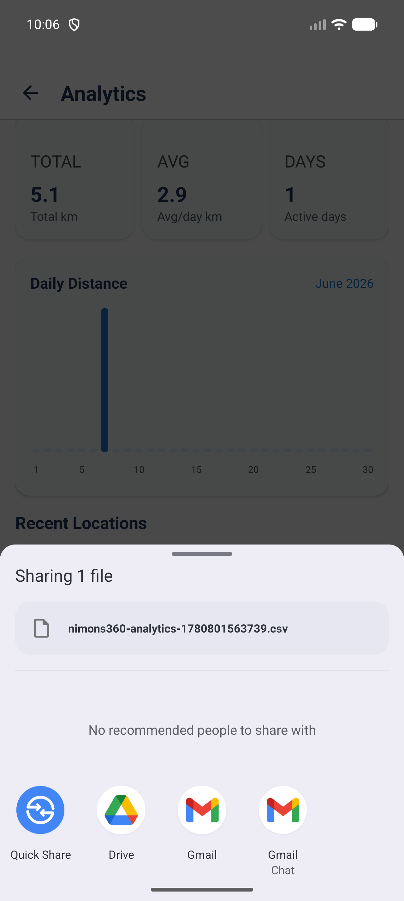 |
| 37 | Browse Families | 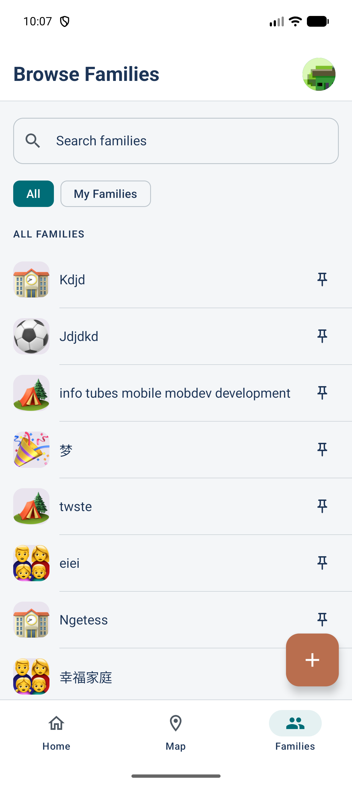 |
| 38 | My Families Filter | 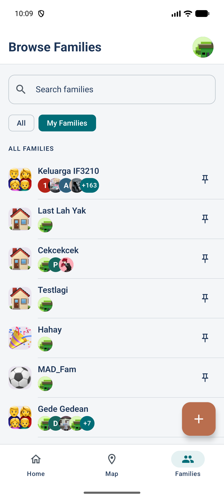 |
| 39 | Responsive Family Detail | 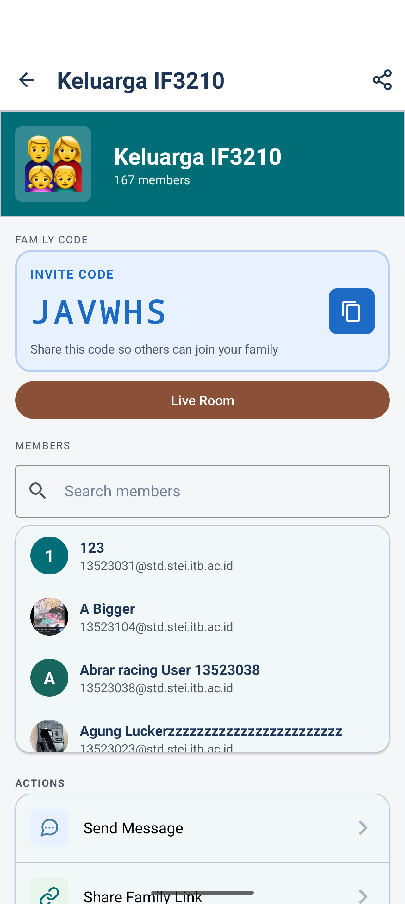 |
| 40 | Family Actions | 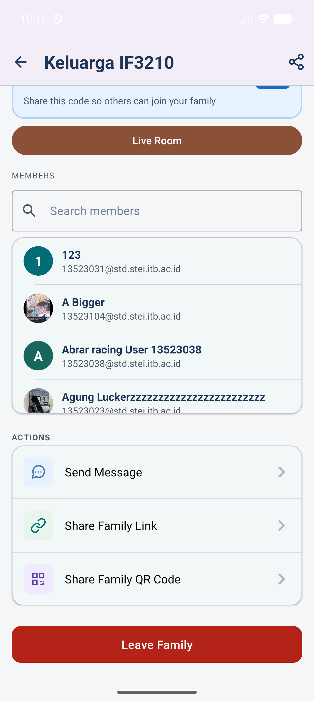 |
| 41 | Family Detail on Tablet | 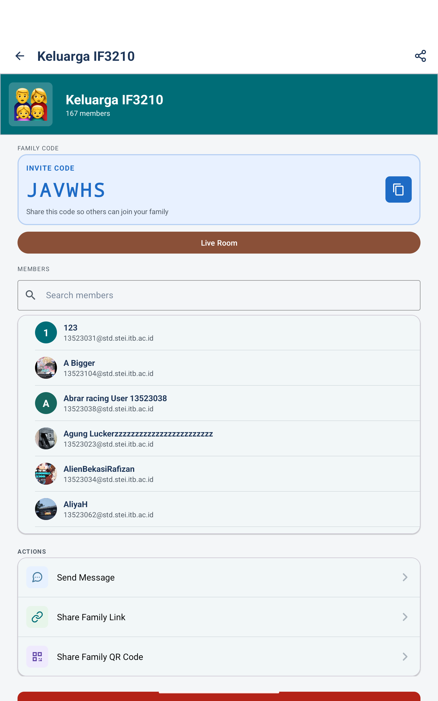 |
| 42 | Share Family QR Code | 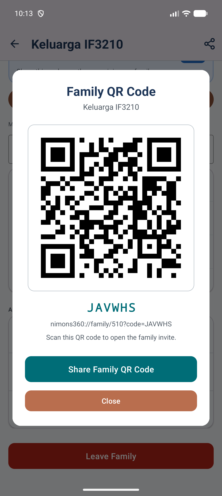 |

Additional full-resolution screenshots are available in [`Screenshots/Original`](Screenshots/Original/).

### Accessibility Testing

| No  | Page                     | Screenshot                                                                                                            |
| --- | ------------------------ | --------------------------------------------------------------------------------------------------------------------- |
| 1   | Home Screen              |             |
| 2   | Families Screen          |           |
| 3   | Profile Screen           |          |
| 4   | Create Family Screen     |    |
| 5   | Family Detail Screen     |    |
| 6   | Map Member Detail Dialog |  |
| 7   | Login Screen |  |

### Improved Interface after Accessibility Testing

| No  | Page                     | Screenshot                                                                                                                                                          |
| --- | ------------------------ | ------------------------------------------------------------------------------------------------------------------------------------------------------------------- |
| 1   | Home Screen              |                                                            |
| 2   | Families Screen          |                       |
| 3   | Create Family Screen     |  |
| 4   | Family Detail Screen     |                                                   |
| 5   | Profile Screen           |                                                         |
| 6   | Map Member Detail Dialog |                                                     |
| 7   | Login Screen             |                                                           |

Berdasarkan report yang disimpan pada folder screenshot, total temuan Accessibility Scanner pada 7 layar yang diuji turun dari kurang lebih 81 suggestion pada kondisi before menjadi kurang lebih 10 suggestion pada kondisi after. Penurunan ini dicapai melalui perbaikan label elemen, kontras teks, dan ukuran minimum area sentuh tanpa mengubah alur maupun fungsionalitas utama aplikasi.

_Keterangan lebih lanjut dapat dilihat pada `Screenshots/Accessibility_After`._

## Project Structure

The source code in `app/src/main/java` is divided as follows:

1. `core`  
   Contains low-level utilities and app-wide helpers.  
   Includes network monitoring, safe API call wrappers, token management, and internal event communication (event bus).

2. `data`  
   Handles all data-related logic.  
   Includes:
   - `model` → Data classes for API, database, and UI state
   - `remote` → API service, Retrofit setup, and interceptors
   - `local` → Room database and DAO definitions
   - `repository` → Abstraction layer combining local + remote data sources
   - `enums` → Shared enums used across the app

3. `ui`  
   Contains all UI-related components.  
   Organized into:
   - `features` → Feature-based screens (auth, families, map, profile, live)
   - `main` → Main navigation, Compose screens, and shared layout structure
   - `theme` → App theming (colors, typography, styling)
   - `shared` → Reusable UI components

4. `viewmodel`  
   Contains all ViewModels and their factories.  
   Responsible for managing UI state, handling business logic, and connecting repositories to the UI layer.

5. `MainActivity.kt`  
   Entry point of the application.  
   Hosts the main UI and navigation container.

6. `MainApplication.kt`  
   Application-level setup.  
   Initializes global dependencies such as repositories, database, and token manager.

---

While `app/src/main/res` contains Android resources used by the app:

1. `anim`  
   Animation resources.

2. `drawable`  
   Images, shapes, and drawable assets.

3. `layout`  
   XML-based UI layouts (used alongside Compose where needed).

4. `mipmap`  
   App launcher icons for different screen densities.

5. `values`  
   Static resources such as strings, colors, dimensions, and themes.

## Program Commands

### Building APK

You could use the APK "app-release" in the "apk" directory and use in an android device or emulator

Should you want to build the project yourself, run the following command in root of this project for debug build:

```bash
./gradlew assembleDebug
```

For release build:

```bash
./gradlew assembleRelease
```

### Additional Commands

Debug command to clear tokens

```bash
adb shell pm clear com.labpro.nimons360
```

## Creators

<table>
    <tr align="left">
        <td><b>NIM</b></td>
        <td><b>Name</b></td>
        <td align="center"><b>GitHub</b></td>
    </tr>
    <tr align="left">
        <td>13523068</td>
        <td>Muh. Rusmin Nurwadin</td>
        <td align="center" >
            <div style="margin-right: 20px;">
            <a href="https://github.com/Rusmn" >
                 
                <br/> <sub><b> @Rusmn </b></sub>
            </a><br/>
            </div>
        </td>
    </tr>
    <tr align="left">
        <td>13523100</td>
        <td>Aryo Wisanggeni</td>
        <td align="center" >
            <div style="margin-right: 20px;">
            <a href="https://github.com/Staryo40" >
                 
                <br/> <sub><b> @Staryo40 </b></sub>
            </a><br/>
            </div>
        </td>
    </tr>
    <tr align="left">
        <td>13523114</td>
        <td>Guntara Hambali</td>
        <td align="center" >
            <div style="margin-right: 20px;">
            <a href="https://github.com/guntarahmbl" >
                 
                <br/> <sub><b> @guntarahmbl </b></sub>
            </a><br/>
            </div>
        </td>
    </tr>
</table>

## Team Roles

| Contributor | Features |
| --- | --- |
| 13523068 - Muh. Rusmin Nurwadin | Map and GPS, WebSocket presence, map member information, internet status, phone orientation, marked locations, Map Extended, Analytics, and accessibility testing |
| 13523100 - Aryo Wisanggeni | Authentication, header and bottom navigation, Home, family list, profile detail and editing, profile photo, notifications, customizable icon, create/join/leave family, family detail, and family search |
| 13523114 - Guntara Hambali | Livestreaming, network sensing, OpenAPI, favorite locations, family sharing, QR sharing, and Instagram Story sharing |
| All contributors | Responsive UI, OWASP review, integration testing, and release verification |

## Preparation and Working Hours

| NIM      | Name                 | Preparation Hours | Working Hours | Notes                      |
| -------- | -------------------- | ----------------- | ------------- | -------------------------- |
| 13523068 | Muh. Rusmin Nurwadin | 6                 | 54            | Kurang lebih 6 jam perhari |
| 13523100 | Aryo Wisanggeni      | 6                 | 54            | Kurang lebih 6 jam perhari |
| 13523114 | Guntara Hambali      | 6                 | 54            | Kurang lebih 6 jam perhari |
